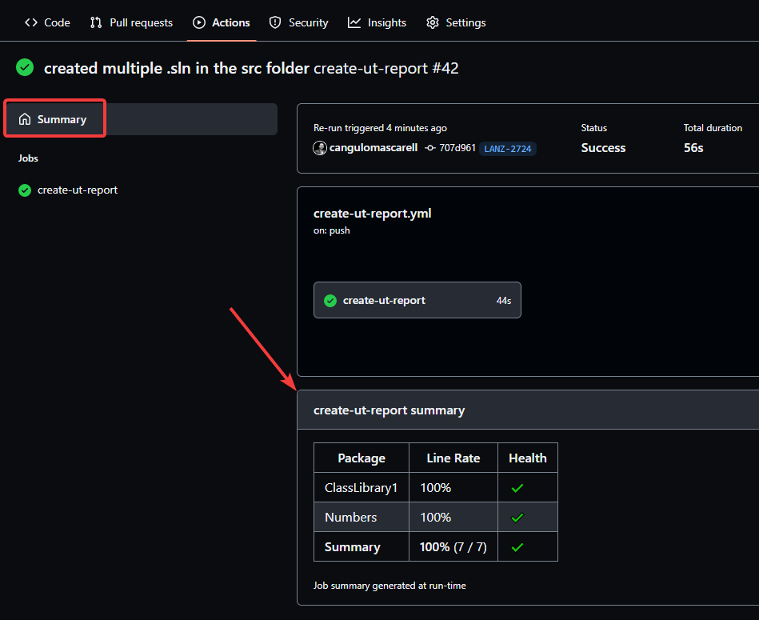

# dotnet-test-gh-action

This action performs a _dotnet test_ on any solution (.sln file) inside the specified folder. The (required) input is _sln-folder_. Here is an example:

```yaml
name: CI
on:
  pull_request:
    branches: ["main"]
jobs:
    build:
    runs-on: ubuntu-latest
    steps:
      - uses: actions/checkout@v2
      - uses: ohpensource/dotnet-test-gh-action@v0.2.2
        name: Test dotnet application
        with:
          sln-folder: "src"
          add-reports-to-job-summary: false
```

## Test Reports in the Job Summary

```yaml
name: CI
on:
  pull_request:
    branches: ["main"]
jobs:
    build:
    runs-on: ubuntu-latest
    steps:
      - uses: actions/checkout@v2
      - uses: ohpensource/dotnet-test-gh-action@v0.2.2
        name: Test dotnet application
        with:
          sln-folder: "src"
          add-reports-to-job-summary: true  # enable this
          test-filter: FullyQualifiedName~UnitTests # optinal --filter argumetn for dotnet test command
```

output example:



The reports mapping uses the GH action: [irongut/CodeCoverageSummary@v1.2.0](https://github.com/marketplace/actions/code-coverage-summary)


# License Summary

This code is made available under the MIT license. Details [here](LICENSE).

---

## You want to improve this GH action?

If you want to introduce changes in this solution, those will be tested in the step `test-main-script` at (.github/workflows/ci.yml)[.github/workflows/ci.yml] when you create a PR:

```yml
  test-main-script:
    runs-on: ubuntu-latest
    steps:
      - uses: actions/checkout@v2
        with:
          fetch-depth: 0
      - name: Execute script
        run: |
          source functions/logger.sh
          ./run-dotnet-tests.sh "test-gh-action"
```

There is a dotnet solution in the `test-gh-action` folder for testing purposes.
